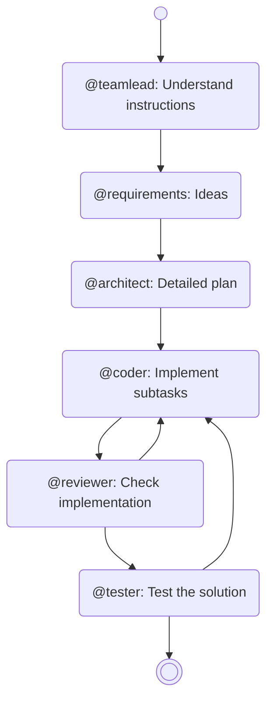
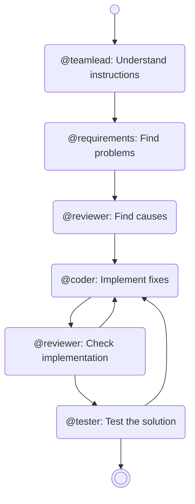
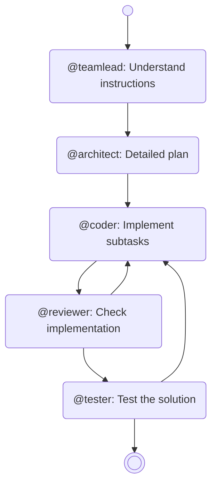

# OpenCode configurations for AI Development

## Get started

1. Install OpenCode [[instructions](https://opencode.ai/docs/#install)]
2. Clone or download this repository into `C:\Users\<user>\.config\opencode` (global) or into your project folder
3. Adjust the configuration as you like

## Roles

The different agents and subagents should depict like an real software development team.
I'm using a GitHub Copilot subscription to get access to all the different models.
But of course the provider and used models can be changed in the opencode configuration.

- Main agent (@teamlead): mostly using GPT 5 Mini; works as the team lead and instructor of the other subagents
- Requirements engineer (@requirements): Claude Sonnet 4
- Application architect (@architect): GPT 5
- Software engineer (@coder): Claude Sonnet 4.5
- Implementation Reviewer (@reviewer): Claude Sonnet 4
- Software Tester (@tester): GPT 5 Mini
- Documenter (@documenter): Claude Sonnet 4
- Security Auditor (@auditor): GPT 5

## AI Role Workflows

These workflows can be used as commands directly in OpenCode itself.

### Feature (`/feature`)

### Bug (`/bug`)

### Task (`/task`)

## Project Setup

- Execute `opencode /init` to create an AGENTS.md file
- Fill it with the project specific information needed to develop in that project
  - Compare with your general AGENTS.md file
  - Content to have in there: project specific technology stack, folder structure, special patterns

## Instruction Workflows

1. Create folder `mkdir ../foo`
2. Create branch `git checkout -b foo`
3. Create git worktree using the folder `git worktree add ../foo foo`
4. Swith to folder `cd ../foo`
5. Call opencode `opencode`
6. Instruct the main agent to implement the feature `/feature blabla`
7. If completed and tested push and merge into main `git commit -m "bla"; cd ../<main>; git merge foo`
8. Delete worktree `git worktree remove foo`
9. Delete folder `rmdir ../foo`

## Additional Scripts provided

- **Opencode Powershell Script `opencode.ps1`**: Wrapper for the opencode command, simplifying the integration in other scripts or CI/CD pipelines. It contains a check for the availability of the opencode command itself and the model to use.
- **Summarization of Github Pull Request `summarize-github-pr.ps1`**: Script taking a repo and pr id for generation of a summary of the changes made in a pr based on it's git diff provided by the Github API.
- **Summarization of Gitlab Merge Request `summarize-gitlab-mr.ps1`**: Analogically to the github summarization script it generates a summary of the changes made in a mr based on the git diff.
